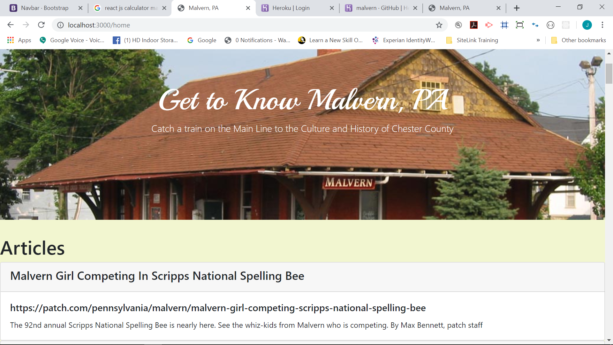

# malvern-patch

I am unable to complete this assignment. The only criteria I am able to complete are...
- scraping from a website
- using Handlebars
- deploying to Heroko? (It is deployed https://malvern.herokuapp.com/  I can't tell if the database is connected properly)

I was not able to complete the functionality of making notes, saving items and deleting items. I really do not understand how to do this. I started this project by copying Unit 18 Mongoose/Activity 20-Scraping-With-Mongoose. So I did have the note functionality. But, I really didn't do anything except swap out the scrape function -- this didn't really seem to be the point of the homework. So, I lost most of the note functionality when I began working with Handlebars.

Using Handlebars was presented as important. So, I spent considerable time reviewing video tutorials on this https://www.youtube.com/watch?v=bOHysWYMZM0. I worked with my tutor provided by Trilogy and he wasn't very familiar with Handlebars. After working with my Professor, I was able to figure out how to render the scraped articles with Handlebars.

As is often the case, following the activities in class does not necessarily mean I am able to successfully recreate on my own. I really don't understand how to make notes, save items and delete items. I even watched the video of the homework solution (https://www.youtube.com/watch?v=17-n9ImiWVc) -- that pretty much clinched it -- I have no idea how to do this. I also thought it was interesting how little the solution utilized Handlebars. It did not use it to render data results.

